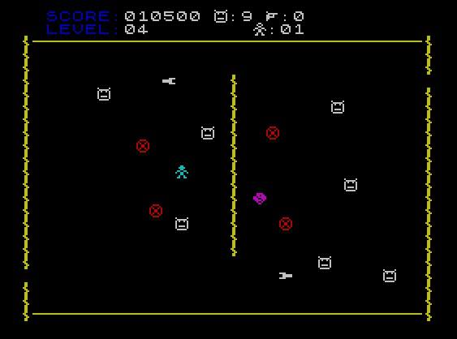
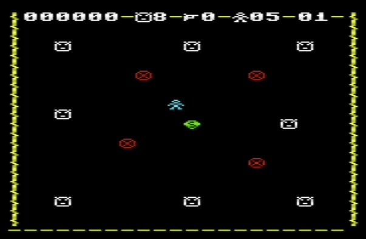
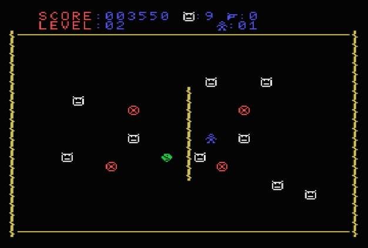
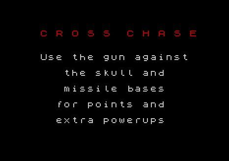

# CROSS CHASE
CrossLib and CROSS CHASE

by Fabrizio Caruso (Fabrizio_Caruso@hotmail.com)

This is a personal project whose goal are the creation of:
1. a universal 8-bit abstraction layer "CrossLib" for coding universal 8-games
2. a "universal" 8-bit game "CROSS CHASE" that has to be a fun and that should run
on (nearly) ALL 8 bit computers and consoles using the Motorola 6809, the MOS 6502, the Zilog Z80 and derivatives CPUs.
The game will be the proof of concept of how flexible the library is.

HOW IS THIS DONE?
This is achieved  by having "CrossLib" provide APIs for the game code.
The game and library code are  separated: 
- the game code only depends on the APIs interface and 
- the APIs do not depend on the game code. Therefore it must be possible to re-use the same library for other games/programs.

The program is written in ANSI C and currently compiled with 
- CC65 for all 6502 targets (http://www.cc65.org/), 
- SCCZ80 (from Z88DK) for most Z80 targets (https://www.z88dk.org/), 
- ZSDCC (from Z88DK) for some Z80 targets (https://www.z88dk.org/),
- CMOC for most 6809 targets (https://perso.b2b2c.ca/~sarrazip/dev/cmoc.html),
- WinCMOC for some 6809 targets (https://sourceforge.net/projects/cmoc-win32/).

For other targets, GCC6809 for other 6809 targets, sdcc (proper or its CPCTelera version), as well as "GCC for TI" for the Texas TI99/4a are being taken into consideration. 

The game should be as portable as possible.
Therefore the following coding choices and design rules are applied:
1. ANSI C (for the game logic);
2. strictly separated input/output and hardware-dependent code from the game logic;
3. the prefered default graphics and input implementation is provided by conio.h (as implemented in CC65, Z88DK and WinCMOC), whenever no specialized code for a specific target is implemented;
4. joystick-related libraries as found in CC65 and in Z88DK;

Some target(s) may get specific graphic code with re-defined characters, software/hardware sprites and music/sound effects.

SUPPORTED TARGETS (2017/06/07)

abc80: ABC 80
ace: Jupiter Ace
apple2: Apple ][ 
apple2enh: Enhanced Apple //e
aquarius: Mattel Aquarius 
atari5200: Atari 5200
atari: Atari 400/800
atari_lynx: Atari Lynx
c128_8502: Commodore 128 [8502 CPU; additionally Z80 versions are built]
c128_z80: Commodore 128 [Z80 CPU; additionally 8502 versions are built]
c16: Commodore 264 series (16/116/+4)
c64: Commodore 64
cbm510: Commodore CBM 510
cbm610: Commodore CBM 610
coco: Color Computer / Dragon 32/64
cpc: Amstrad CPC
cpm: CP/M with adm3a/vt52/vt100 terminals
creativision: VTech Creativision
eg2k: EACA EG2000
einstein: Tatung Einstein
gal: Galaksija
gamate: Gamate
kc: Robotron KC-85/2/3/4
lambda: Lambda 8300
m5: Sord M5
mc1000: CCE MC-1000
microbee: Microobee
msx: MSX
mtx: MTX 512
nascom: Nascom
nc100: Amstrad NC-100
nes: Nintendo Enterteinment System
oric: Tangerine Oric 1/Atmos
osic1p: Ohio Scientific 1P
p2000: Philips P2000
pc6001: NEC PC 6001
pce: PCEngine
pet: Commodore Pet
pps: Sprinter
pv2000: Casio PV2000
px4: Epson PX-4/HC-40
px8: Epson PX-8/HC-80
samcoupe: Sam Coupe
sc3000: Sega SC 3000
sharp_mz: Sharp MZ
spectrum: Sinclair Spectrum 16k/48k/12k
srr: Exidy Sorcerer
supervision: Watara Supervision
svi: Spectravideo 318/328
ti82: Texas TI 82
ti83: Texas TI 83
ti85: Texas TI 85
trs80: TRS-80 Model I/III/IV
vg5k: VG-5000
vic20: Commodore Vic 20
vz200: VTech VZ200
x1: Sharp X1
z1013: Robotron Z1013
z9001: Robotron Z9001
zx80: Sinclair ZX80
zx81: Sinclaur ZX81

-------------------------------------------

As a consequence of the design, the code includes a framework that could be used to develop other massively multi-system games and programs. 

LICENSE

This software is provided 'as-is', without any express or implied warranty.
In no event will the authors be held liable for any damages arising from
the use of this software.

Permission is granted to anyone to use this software for non-commercial applications, 
subject to the following restrictions:

1. The origin of this software must not be misrepresented; you must not
claim that you wrote the original software. If you use this software in
a product, an acknowledgment in the product documentation would be
appreciated but is not required.

2. Altered source versions must be plainly marked as such, and must not
be misrepresented as being the original software.

3. This notice may not be removed or altered from any source distribution.
