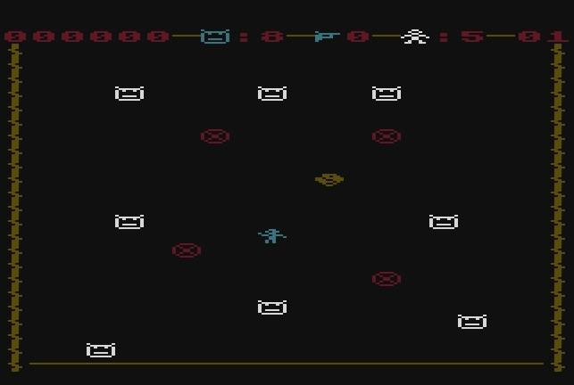
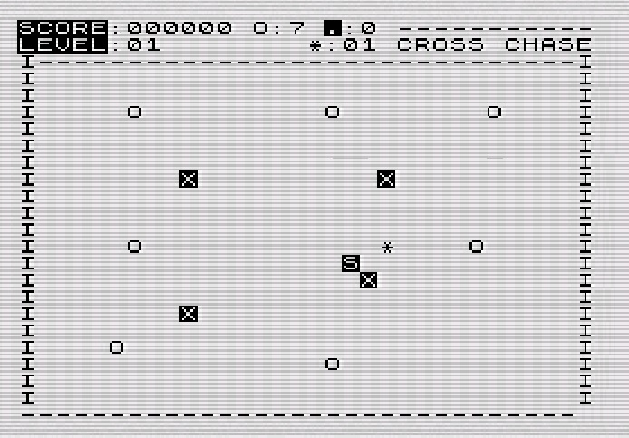
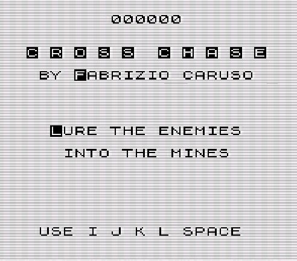
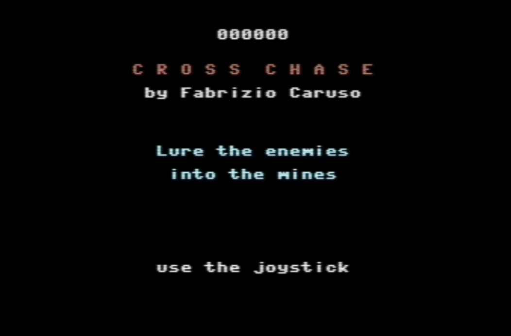
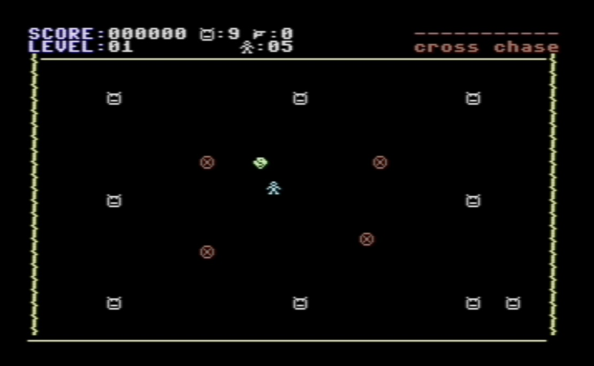

# CROSS CHASE
Cross Lib and Cross Chase

by Fabrizio Caruso (fabrizio_caruso@hotmail.com)

## THE GOAL

This is a personal project whose goal is the creation of:
1. the universal 8-bit abstraction layer "Cross Lib" for coding universal 8-bit games
2. the "universal" 8-bit game "Cross Chase" that has to be a fun and that should run
on (nearly) ALL 8 bit computers, consoles, handhelds and scientific calculators. 
The game will be the proof of concept of how flexible the library is.

## THE GAME 
The game's goal is to lure the "ghosts" into the mines and possibly kill the "skull" by repeatedly using the gun.
You have to avoid all enemies, the mines, all walls, rockets and chasing missiles.
All flashing items have positive effects and can grant you some special powers. Discover the 10 items.
If you use the gun against the skull and/or the missiles and rockets, you can unlock some special secret items.

You can play the game on-line for different targets:

1. MSX version: https://homebrew.file-hunter.com/index.php?id=crosschase
2. Commodore 264 series (C16/C116/C+4): http://plus4world.powweb.com/play/cross_chase_32k_v0_9
3. Sinclair ZX Spectrum 48K: https://spectrumcomputing.co.uk/playonline.php?eml=1&downid=112056
4. Atari LYNX: https://atarigamer.com/lynx/play/CrossChase/675300242

## CURRENTLY SUPPORTED ARCHITECTURES
The main goal is to get the library and game to work on most 8-bit architectures but other systems are also considered.

### 8-BIT ARCHITECTURES
- COSMAC RCA 1802
- Intel 8080 and its derivatives
- MOS 6502 and its derivatives
- Motorola 6809 and its derivatives
- Zilog 80 and its derivatives

### 16-BIT ARCHITECTURES
- Motorola 68000/68008
- Zilog Z8000
- Intel 8088/8086 
- PDP11
- MOS 65816

### 32-BIT ARCHITECTURES
- PowerPC
- Intel 386
- Motorola 68020
- MIPS32r2 (little-endian)

### 32/64-BIT ARCHITECTURE
We also support any current architecture for which GCC can produce a working binary.

## THE TOOL-CHAIN

How is it this done?
This is achieved  by having "Cross Lib" provide APIs for the game code.
The game and library code are  separated: 
- the game code only depends on the APIs interface and 
- the APIs do not depend on the game code. Therefore it must be possible to re-use the same library for other games/programs.

The program is written in ANSI C and currently compiled with 
- CC65 for all MOS 6502 targets (http://www.cc65.org/), 
- SCCZ80 (from Z88DK) for most Zilog 80 and Intel 8080 targets (https://www.z88dk.org/), 
- ZSDCC (from Z88DK) for some Zilog 80 and Intel 8080 targets (https://www.z88dk.org/),
- CMOC for Motorola 6809 targets (https://perso.b2b2c.ca/~sarrazip/dev/cmoc.html),
- LCC1802 for COSMAC RCA 1802 targets (https://sites.google.com/site/lcc1802/downloads),
- ACK for PC 8088/8086, CP/M Intel 8080, Linux 386/68K/PPC/MIPS, PDP11 (https://github.com/davidgiven/ack),
- XTC68 (C68) for the Motorola 68008-based Sinclair QL (https://github.com/stronnag/xtc68),
- Z8KGCC for the Zilog Z8000-based Olivetti M20 series (http://www.z80ne.com/m20/sections/download/z8kgcc/z8kgcc.html),
- "GCC for Atari ST" (http://vincent.riviere.free.fr/soft/m68k-atari-mint/),
- "GCC for Amiga" (https://github.com/bebbo/amiga-gcc),
- "GCC for TI" for the Texas TI99/4a (http://atariage.com/forums/topic/164295-gcc-for-the-ti/page-6),
- GCC for modern 32/64-bit PC under any operating systems 

Previous versions used 
- WinCMOC for 6809 targets  (https://sourceforge.net/projects/cmoc-win32/).
WinCMOC has been abandoned because it uses an old CMOC version that has broken pointer to functions and because it is no longer maintained by its author. 

For other targets, the following compilers and dev-kits may be included in future versions of the tool-chain:
- QDOS-GCC for the Sinclair QL (http://morloch.hd.free.fr/qdos/qdosgcc.html)
- SDCC for Z80 and other targets (http://sdcc.sourceforge.net/),
- PVSNESLIB for the Super Nintendo Entertainment System (https://github.com/alekmaul/pvsneslib),
- amiga-os-toolchain for all Amigas (https://github.com/cahirwpz/amigaos-cross-toolchain),
- GCC6809 for other 6809 targets (https://sourceforge.net/projects/freewpc/files/GCC-6809/),
- TIGCC for 68k-based TI calculators (http://tigcc.ticalc.org/).

The tool-chain also uses some third-party target-specific tools to create usable cassette/disk/rom images.
This is documented in https://github.com/Fabrizio-Caruso/CROSS-CHASE/blob/master/tools/README.txt

## HOW TO COMPILE THE GAME
In order to compile the game you need to be in a POSIX environment such as Windows+Cygwin, Linux, FreeBSD, MacOS or any Unix-like environment that supports the "make" command.

### Prerequisites
- [Non-UNIX only] Install a POSIX environment if necessary, e.g., Cygwin.
- Install `make` in your environment.
- Install the required cross-compilers (see list of supported cross-compilers above).
- [Only some compilers] Install the additional requirements for a given cross-compiler, e.g., CMOC and LCC1802 require a separate linker, some GCC targets require "ncurses".
- [Only some compilers] Make sure they are either installed as described in the Makefile variables: `Z88DK_PATH`, `CC65_PATH`, `LCC1802_PATH`, etc. or set these variables accordingly.
- [Z88DK-only] Select the optimization level in Makefile by setting the variables:
-- `SCZZ80_OPTS` (`-O3` for highest optimizations)
-- `ZSDCC_OPTS` (`-SO3` for high optimizations; `-SO3 --max-allocs-per-node200000` for highest and extremely slow optimizations)

### Compile all targets for a given cross-compiler
Run `make [compiler name]_targets` where the [compiler name] is of one these:
- `ack`
- `cc65`
- `cmoc`
- `emcc` (totally experimental Emscripten to produce WebAssembly/Javascript)
- `gcc`
- `gcc_amiga`
- `gcc_atari_st`
- `gcc_z8k` (currently buildable only under Linux)
- `lcc1802`
- `xtc68`
- `z88dk` (for both SCCZ80 and ZSDCC cross-compilers in Z88DK)

Examples: 
- `make cmoc_targets` builds all targets that are built with the CMOC cross-compiler for the Motorola 6809 systems.
- `make gcc_targets` builds all targets by using GCC for the host console (e.g., CYGWIN, Linux, etc. console).
- `make cc65_targets` builds all targets that are built with the CC65 cross-compiler for the MOS 6502 systems.
- `make z88dk_targets` [EXTREMELY SLOW] builds all targets that are built with the SCCZ80 and ZSDCC cross-compilers of the Z88DK dev-kit for Zilog 80 and Intel 80 systems.

### Compile all targets for a given system 
Run `make [system name]_targets`, where [system name] is one of the systems listed in the section "SUPPORTED TARGETS " of this document.

Examples:
- `make vic20_targets` builds all Commodore Vic 20 binaries (different versions of the game for different memory configurations).
- `make spectrum_targets` builds all Sinclair Spectrum binaries (different versions of the game for different memory configurations).
- `make zx81_targets` builds all ZX81 binaries ((different versions of the game for different memory configurations and different graphics configurations such as WRX hi-res).

### Compile a specific target
For this you currently need to look inside the Makefile file to have the exact target name to use with the "make" command.

Examples: 
- `make c64` builds a Commodore 64 binary.
- `make gcc_buffered` builds a GCC buffered and turn-based version for the host console.
- `make ti83` builds a binary for the Texas Instrument TI 83 scientific calculator.
- `make pc8086` builds a binary for the PC 8086/8088 (a floppy disk image to be run on a Intel 8086/8088 PC).
- `make nes` builds a bianry for the Nintendo NES videogame console.

### Special cases
Some targets, e.g., CP/M and Commodore 128, can be built by two different compilers because they can run different CPU architectures or because we may want to have multiple versions.
In such cases we can specify the version or architecture:

Examples:
- `make c128_targets` builds all Commodore 128 targets for both the MOS 8502 and for the more exotic Zilog 80 non-CP/M mode.
- `make c128_8502_targets` builds all Commodore 128 targets for the MOS 8502 architecture in both 40 and 80 column mode.
- `make c128_z80_targets` builds all Commodore 128 targets for the Zilog 80 non-CP/M mode in both 40 and 80 column mode.
- `make cpm_targets` builds all generic CP/M targets for both the Intel 8080 and Zilog 80 architecture.
- `make cpm_8080_targets` builds all generic CP/M targets for the Intel 8080 architecture (compatible with Zilog 80 systems).
- `make cpm_z80_targets` builds all generic CP/M targets for both the Zilog 80 architecture (not compatible with Intel 8080 systems).

## THE GAME CODE

The game should be as portable as possible.
Therefore the following coding choices and design rules are applied:
1. ANSI C (for the game logic);
2. strictly separated input/output and hardware-dependent code from the game logic;
3. input for keyboard/joystick and output for sound and display are provided by CrossLib

Some target(s) may get specific graphic code with re-defined characters, software/hardware sprites and music/sound effects.

## SUPPORTED TARGETS 

(as of 2020/05/04)
 
### 8-BIT versions

For most targets, more than one version is built, in order to support different hardware configuratins and expansions 
(e.g., memory expansions, second CPU, 80-col display card, etc.).

- abc80: Luxor ABC 80
- abc800: Luxor ABC 800 (work in progress)
- ace: Jupiter Ace
- alphatro: Alphatronic
- apple2: Apple //
- apple2enh: Enhanced Apple //e
- aquarius: Mattel Aquarius 
- atari5200: Atari 5200
- atari: Atari 400/800/600XL/800XL/1200XL/65XE/130XE
- atari_lynx: Atari Lynx
- attache: Otrona Attache
- aussie: Aussie Byte
- bic: BIC/A5105 (work in progress)
- c128_8502: Commodore 128 [8502 CPU]
- c128_z80: Commodore 128 [Z80 CPU]
- c16: Commodore 264 series (16/116/+4)
- c64: Commodore 64
- c7420: Philips VideoPac C7420 module (work in progress)
- cbm510: Commodore CBM 510
- cbm610: Commodore CBM 610
- camputers_lynx: Camputers Lynx 48k/96k/128k
- coco: Color Computer
- coleco: Colecovision
- coleco_adam: Colecovision Adam (work in progress)
- comx: COMX-35 (work in progress)
- cpc: Amstrad CPC
- cpm8080: CP/M Intel 8080
- cpm: CP/M Z80 with adm3a/vt52/vt100 terminals
- creativision: VTech Creativision
- dmv: Decision Mate V (work in progress)
- dragon: Dragon 32/64
- eg2k: EACA EG2000 Color Genie
- einstein: Tatung Einstein
- enterprise: Enterprise 64/128
- excalibur64: Excalibur64 (work in progress)
- fp1100: Casio FP-1100
- g800: Sharp PC-G800
- gal: Galaksija
- gamate: Gamate
- gb: Game Boy (work in progress)
- gx4000: Amstrad GX-4000
- hemc: HueblerEvertMC (work in progress)
- hgmc: HueblerGrafikMC (work in progress)
- homelab: Homelab 4 (work in progress)
- homelab2: Homelab 2 (work in progress)
- kaypro: Kaypro 2X
- kramermc: Kramer-MC (work in progress)
- kc: Robotron KC-85/2/3/4
- lambda: Lambda 8300
- laser500: Laser 500
- m100: TRS-80 M100
- m5: Sord M5
- mc1000: CCE MC-1000
- microbee: Microobee
- mikro80: Mikro 80 (work in progress)
- mo5: Thomson Mo5/Mo6/Prodest PC128 (work in progress)
- msx: MSX
- mtx: Memotech MTX 512
- multi8: Mitsubishi Multi 8
- myvision: Nichibutsu My Vision (work in progress)
- mz: Sharp MZ 80/700
- mz2500: Sharp MZ 2500
- nascom: Nascom
- nc100: Amstrad NC-100/150
- nc200: Amstrad NC-200
- nes: Nintendo Enterteinment System
- newbrain: Grundy Newbrain
- oric: Tangerine Oric 1/Atmos
- osborne1: Osborne 1
- osca: OSCA v6z80p
- osic1p: Ohio Scientific Challenger 1P
- oz: Sharp OZ-700
- p2000: Philips P2000
- pc6001: NEC PC 6001
- pasaopia7: Toshiba Pasopia 7 (work in progress)
- pc88: NEC PC 8801 (work in progress)
- pce: PCEngine
- pencil2: Hanimex Pencil II
- pet: Commodore Pet
- pmd85: PMD85 (work in progress)
- pps: Peters Plus Sprinter
- primo: Primo (work in progress)
- pv1000: Casio PV1000
- pv2000: Casio PV2000
- px4: Epson PX-4/HC-40
- px8: Epson PX-8/HC-80
- qc10: Epson QC-10/QX-10 (work in progress)
- rex: Xircom Rex 6000 (work in progress)
- rc700: Regnecentralen RC700
- rx78: Bandai RX-78
- samcoupe: Sam Coupe
- sc3000: Sega SC 3000
- sg1000: Sega SG 1000
- smc777: Sony SMC-70 / SMC-777 (work in progress)
- sms: Sega Master System
- sos: S-OS 
- spc1000: Samsung SPC 1000
- spectrum: Sinclair Spectrum 16k/48k/128k
- srr: Exidy Sorcerer
- super80: Super 80/80d/80e/80m (work in progress)
- super80r: Super 80r/Super80v (work in progress)
- supervision: Watara Supervision (work in progress)
- sv8000: Bandai Supervision 8000 (work in progress)
- svi: Spectravideo 318/328
- telestrat: Oric Telestrat (work in progress)
- ti82: Texas TI 82
- ti83: Texas TI 83
- ti8x: Texas TI 83 Plus
- ti85: Texas TI 85
- ti86: Texas TI 86
- tiki100: TIKI 100
- to7: Thomson To7(/70)/To8/To8d/To8+/To9/To9+ (work in progress)
- trs80: TRS-80 Model I/III/IV
- ts2068: Timex TS 2068
- tvc: Videoton TV Computer (work in progress)
- tvz80game: TV Z80 Game (work in progress)
- vector06: Вектор-06Ц - Vector06c (work in progress)
- vg5k: VG-5000
- vic20: Commodore Vic 20
- vz200: VTech VZ200
- x07: Casio X-07 (work in progress)
- x1: Sharp X1
- z1013: Robotron Z1013
- z80tvgame: ZX80 TV Game (work in progress)
- z88: Cambridge Z88
- z9001: Robotron Z9001, Robotron KC 85/1, Robotron KC 87 
- zx80: Sinclair ZX80
- zx81: Sinclair ZX81

### 16-BIT versions
- sinclair_ql: Sinclair QL (work in progress)
- olivetti_m20: Olivetti M20 
- pc8086: Intel 8088/8086 PC
- pdp: PDP 11 v7 (work in progress)
- atari_st: Atari ST (work in progress)
- amiga: Amiga (work in progress)
- cx16: Commander X16 (work in progress)

### 32-BIT versions
- linux386:  ELF linux for Intel 386
- linux68k:  ELF linux for Motorola 68020
- linuxppc:  ELF linux for PPC
- linuxmips: ELF linux for little endian MIPS32r2 (work in progress)

### Modern 32/64-BIT PC versions

There are a plain stdlib (turn based) and an ncurses (action) version that can be compiled for multiple platforms for which an ANSI C compiler and ncurses are available, including Windows and Linux.
For example:
- Cygwin/Windows or Linux (gcc + ncurses, e.g., cygwin/Windows or Linux) 
- Windows 32/64 bit console (mingw-gcc + ncurses, e.g., x86_64-w64-mingw32-gcc)

Remark: 
You can compile the game for any recent or old/ancient architecture for which there is an ANSI C capable compiler.

-------------------------------------------
STATUS - ISSUES

Z80-based targets:
https://docs.google.com/spreadsheets/d/1qo2skBUtCUCAac3knEE2x-bUBdvxEA_6qvElacJ3xNY/edit?usp=sharing

-------------------------------------------

## THE FUTURE

It should be possible to write more universal games using "Cross Lib".

The future main features of "Cross Lib":
- better separation and dependences with the game 
- better support multi-target input/output

## ADAPTIVE GRAPHICS

The tool-chain and CrossLib will produce a game with simple black and white ASCII graphics and no sound if none of these is available. 
If colors, graphics and sounds are available the tool-chain and CrossLib will produce a game with some simple sound effects and with some possibly colored graphics.

## CROSSLIB DETAILS
CrossLib provides an abstraction layer for sound, input, display, etc.

### Sound
Sound abstraction is achieved by providing common APIs for the (few) sounds that CrossLib provides.

### Input
Input abstraction is also achived by common APIs that support either keyboard and/or joystick input for each possible target.

### Display
Display abstaction is provided by (at least) two levels of abstraction:
- Common APIs that, for each target, implement one of several graphics modes;
- Generic graphics modes that may be shared among a few targets.

So, for each target, at least one of the following modes has to be implemented:
1. memory-mapped graphics (display can be implemented by writing bytes into video memory)
2. conio-like (display is performed by either direct conio APIs or a wrapper that provides conio APIs, e.g., ADM3/A, VT52, VT100, etc.)
3. TGI (CC65-specific graphics APIs)
4. Z88DK Sprites (Z88DK-specific sprite APIs)
5. CPCRSLIB (Amstrad CPC-specific graphics APIs)
6. bit-mapped (display is implemented by writing into video memory and each bytes corresponds to one or more pixels)
7. buffered (stdlib-only "graphics" for targets with just stdlib support)

A graphic mode may implement the concrete graphics by either calling low level graphics instructions (e.g., writing into video-memory) or by calling higher level instructions (e.g., using control codes).

For example for a CPM target with ADM3/A control codes, we use
1. CrossLib APIs that call
2. conio.h APIs that call
3. ADM3/A control codes

For a target with direct or indirect video memory (e.g., Commodore 64, MSX, etc.), one may use:
1. CrossLib APIs that implement
2. Direct (or indirect) writes into video memory

Remark: For some targets multiple implementations are possible (C64 may use conio APIs as provided by C65, memory-mapped graphics, TGI APIs)

## LICENCE

This software is provided 'as-is', without any express or implied warranty.
In no event will the authors be held liable for any damages arising from
the use of this software.

Permission is granted to anyone to use this software for non-commercial applications, 
subject to the following restrictions:

1. The origin of this software must not be misrepresented; you must not
claim that you wrote the original software. If you use this software in
a product, an acknowledgment in the product documentation would be
appreciated but is not required.

2. Altered source versions must be plainly marked as such, and must not
be misrepresented as being the original software.

3. This notice may not be removed or altered from any source distribution.

